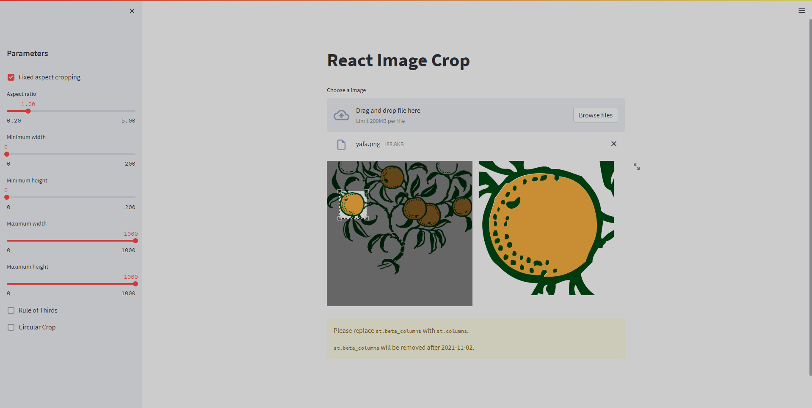

## Localhost

I should have tested it on `python38`. Old screenshot with the not pretty resolution `1920x1080`:



But now I mainly use `python39`. I don't want to reinstall `python38` on PC. So here's my reasoning. Actually, I want to use `pyenv`, but I meet some problems at present.

```sh
scoop install python38
C:\Users\yourname\scoop\apps\python38\current\python.exe -m pip install poetry
```

```sh
cd streamlit-image-crop
poetry install
C:\Users\yourname\AppData\Local\pypoetry\Cache\virtualenvs\streamlit-image-crop-XXXXXX-py3.8\Scripts\activate.bat
```

```sh
cd streamlit_image_crop/frontend
fnm install 16.20.0
fnm use 16.20.0
npm i
npm run build
serve -s build -l 4321
```

At the same time:

```sh
pip install -U click==8
```

```sh
streamlit run example.py
```

## Reference

[click.get_os_args is deprecated on module 'click 8.1.0'](https://github.com/streamlit/streamlit/issues/4555)