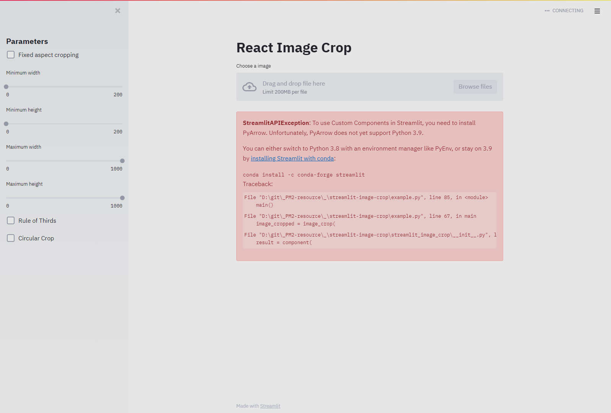
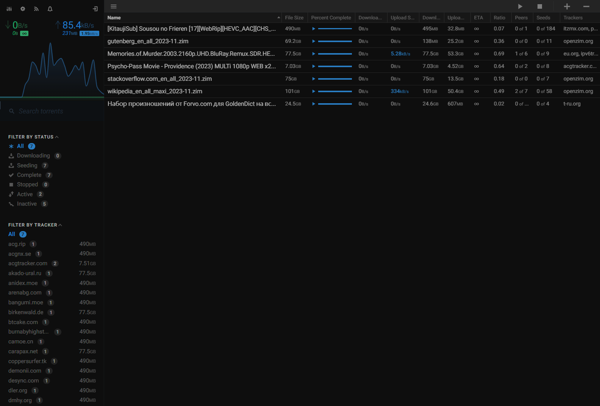

group | source | license | tested | readme | preview
:- | :- | :- | :- | :- | :-
pdf | [Album App for Django](//github.com/jobsta/albumapp-django) |  |  | [.md](_readme/albumapp-django.md) | 
image | [Streamlit Image Crop](//github.com/mitsuse/streamlit-image-crop) |  |  | [.md](_readme/streamlit-image-crop.md) | 
torrent | [flood](//github.com/jesec/flood) |  |  | [.md](_readme/flood.md) | 
rclone | [Rclone-Webui-Angular](//github.com/yuudi/rclone-webui-angular) |  |  | [.md](_readme/rclone-webui-angular.md) | 
accounting | [books](//github.com/frappe/books) |  |  | [.md](_readme/books.md) | 
database | [SQLite Web](//github.com/coleifer/sqlite-web) |  |  | [.md](_readme/sqlite-web.md) | 